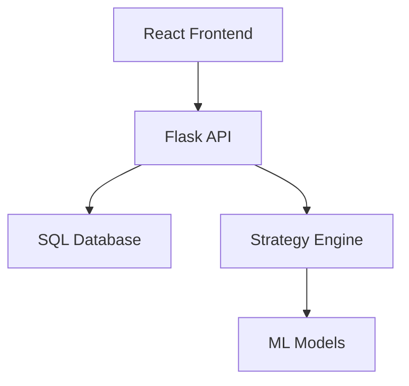

# Trading Strategy Backtester

## Features
- REST API with Flask
- React dashboard
- LSTM-based return prediction
- Web scraping pipeline

## Architecture


## Setup
1. Copy the example environment file:  
   ```bash
   cp .env.example .env